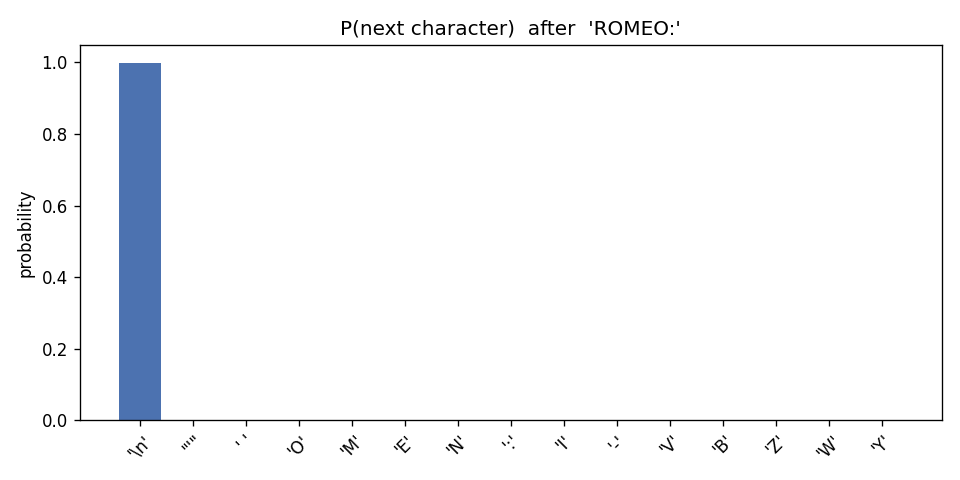
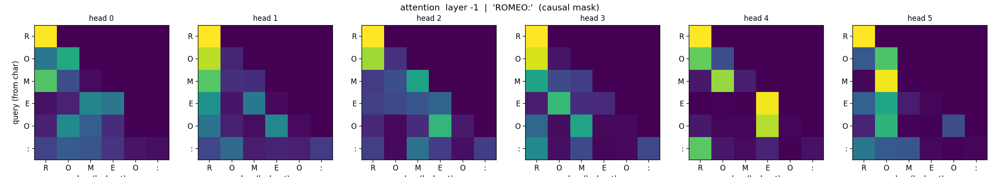
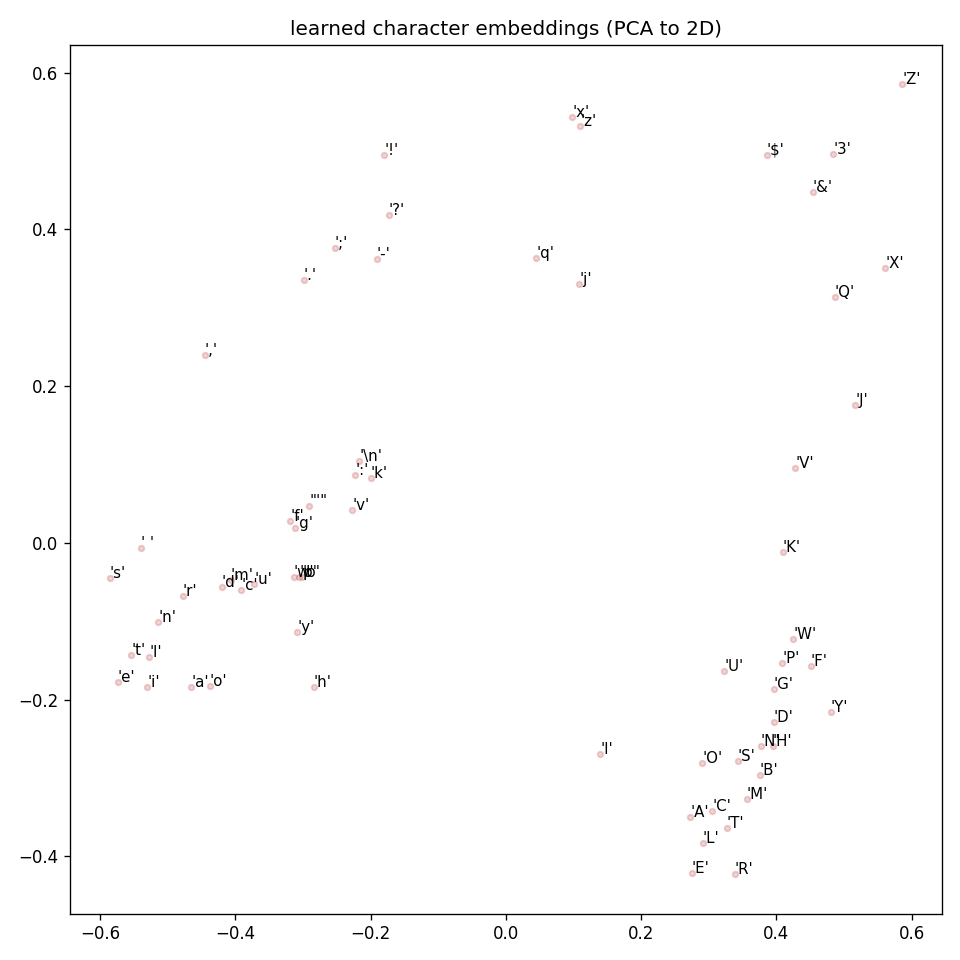

# RoyLM-0

RoyLM-0 is a small character-level GPT trained on Tiny Shakespeare. It is meant
as a readable transformer-from-scratch project: the model learns to predict the
next character, then generates text by repeating that prediction step.

It is not a chatbot or instruction-following model. It continues text in the
style of the training data.

## Visualizations

These plots were generated from the current checkpoint with `python visualize.py`
using the prompt `ROMEO:`.







## Model Stats

### Architecture

| Stat | Value |
| --- | --- |
| Type | Decoder-only transformer (GPT) |
| Parameters | **10.77M** |
| Layers (`n_layer`) | 6 |
| Attention heads (`n_head`) | 6 |
| Embedding width (`n_embd`) | 384 |
| Head size | 64 |
| Context length (`block_size`) | 256 characters |
| Vocabulary | 65 characters |
| Dropout | 0.2 |
| Checkpoint size | 42.6 MiB (`roylm-0.pt`, fp32) |

Only 123K parameters are embeddings. The 6 transformer blocks hold 10.65M
parameters, which is where almost all of the model capacity lives. The previous
small checkpoint had 818K parameters, so this version is about 13x larger.

### Training Setup

| Stat | Value |
| --- | --- |
| Dataset | Tiny Shakespeare |
| Train split | 1,003,854 characters |
| Validation split | 111,540 characters |
| Batch size | 32 sequences |
| Sequence length | 256 characters |
| Steps (`max_iters`) | 5,000 |
| Tokens seen | **40.96M** |
| Full passes over train split | **40.8x** |
| Optimizer | AdamW |
| Learning rate | 3e-4 |
| Gradient clipping | 1.0 |
| Hardware | Apple Silicon GPU (MPS) |
| Wall-clock training time | ~95 minutes |

With only about 1M training characters and 40.8 passes through the data,
`dropout=0.2` helps reduce memorization.

### Validation Benchmark

Measured from the current `roylm-0.pt` checkpoint over 50 validation batches.

| Metric | Random baseline | RoyLM-0 |
| --- | ---: | ---: |
| Cross-entropy loss, nats | 4.17 | **1.48** |
| Perplexity (`e^loss`) | 65.0 | **4.40** |
| Bits per character | 6.02 | **2.14** |

## Setup

```bash
python3 -m venv .venv
source .venv/bin/activate
pip install -r requirements.txt
```

## Run

Prepare the dataset:

```bash
python data/prepare.py
```

Train the model:

```bash
python train.py
```

Generate a sample:

```bash
python sample.py
```

Try an interactive prompt:

```bash
python prompt.py
```

Create diagnostic plots:

```bash
python visualize.py
```

## Project Layout

- `data/prepare.py` downloads Tiny Shakespeare and writes encoded train/val data.
- `model.py` defines the decoder-only transformer.
- `train.py` trains the model and saves `roylm-0.pt`.
- `sample.py` generates text from a checkpoint.
- `prompt.py` runs a simple text-continuation loop.
- `visualize.py` writes attention, embedding, and next-character plots.

Generated data, checkpoints, virtual environments, and caches are ignored by Git.
The visualization PNGs are kept in the repo so they render on GitHub.
